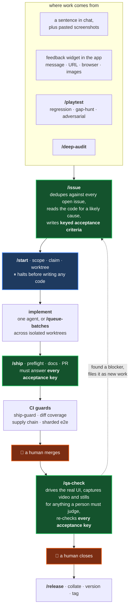
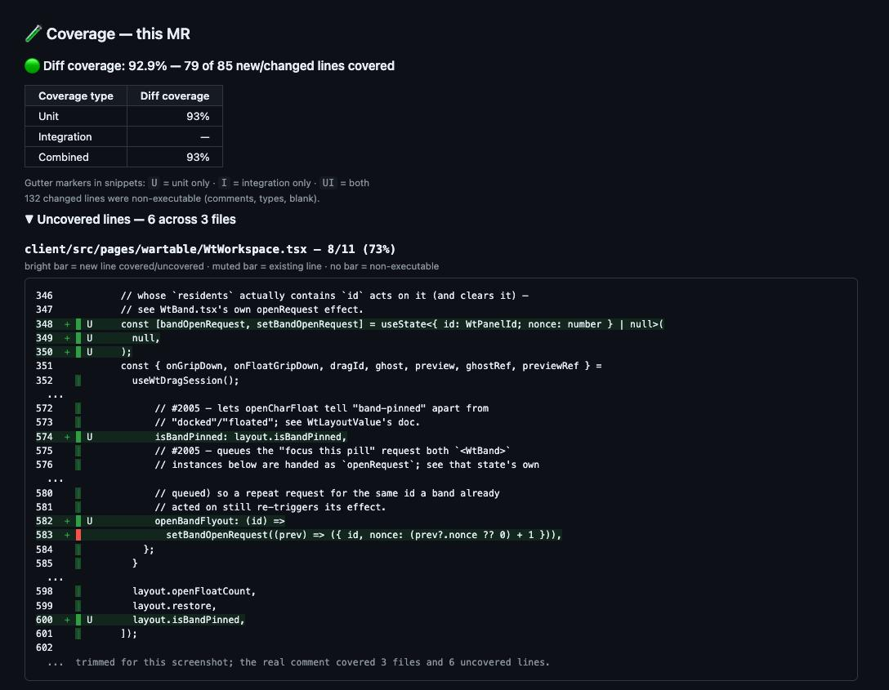

# darkwatch-toolchain

An agent-driven development system I built and ran against **Darkwatch**, a
real-time session manager for the Shadowdark tabletop RPG that I develop solo.
It takes a piece of work from "someone mentioned a bug" to "shipped and
verified", with a coding agent doing most of the typing and humans holding the
two gates that matter.

**It will not drop into your repo, and that is not what it is for.** It is wired
to one project's tracker, database and CI. What travels is the design: where the
agent is trusted, where it is not, and what it took to find the difference. That
record is why it is published.

- **19 skills, 18 CI workflows, 120 scripts**
- **375 commits** across 109 working days, 2026-04-11 to 2026-09-17
- **184 files of tooling**, 41 of them unit tests sitting beside the
  thing they test
- **19 tools split into a pure core and a thin adapter**, so the logic is
  testable with no network and the tracker lives in exactly one file

---

## How the pipeline fits together



The agent files issues and opens pull requests on its own. **It cannot close an
issue and it cannot merge.** The wording enforces it: `ship` emits `Ready #N`
instead of `Closes #N`, so the tracker's auto-close never fires and work cannot
leave the QA state without a person looking at it.

### The acceptance key is the spine

The three green boxes are one mechanism, not three. When `/issue` files something
it ends the body with a keyed checklist:

```
## Acceptance
- [ ] (epoch) A credential change invalidates every outstanding session
- [ ] (audit-row) A login_2fa_challenged row lands on a 2FA challenge, not just a log line
```

Those `(slug)` keys are short, stable, and phrased as **observable outcomes**: a
DOM state, a database row, a response code. Never an implementation note.

They are then enforced rather than just referenced. `/ship` cannot open a PR
without answering every key `met` or `deferred:#M`, and a CI job checks it.
`/qa-check` then re-checks the same keys against the running app, and it does so
**even when the PR's own test plan is green**, because the plan is the shipper's
account of what was built rather than proof it covered the ticket. That rule
exists because an issue once closed as verified on a green plan that covered two
of its three criteria; the plan never mentioned the third.

So a criterion agreed at filing time cannot be quietly dropped at ship time or
waved through at close time. That is what stops an agent from redefining the job
into the part it managed to do.

---

## What it actually produces

Real output, verbatim, from the private repo this runs against.

### [Four words become a diagnosed issue](docs/examples/issue-from-four-words.md)

A player in a live session opened the feedback widget and typed, in full: *"Make
the quests seeable."*

`/issue` opened the component and its CSS module, found the three declarations
responsible (`overflow: hidden; text-overflow: ellipsis; white-space: nowrap`),
and worked out the constraint the reporter had not mentioned and probably did not
know: the only way to read a quest in full was to open the *edit* form, so
reading required entering an editing surface. It quoted the truncated strings out
of the session screenshots as evidence, proposed a fix direction without
implementing it, noted that it has to work for read-only players too,
cross-referenced two related issues after a duplicate check, and wrote two keyed
acceptance criteria.

The widget carries the message, the URL, the browser and any images, so a report
arrives with its context attached. Screenshots pasted into a chat work the same
way: they get uploaded to the tracker and embedded in the issue body.

Four words in, a diagnosis and two verifiable criteria out. A person still
decides whether to build it.

### [A PR body from `/ship`](docs/examples/ship-pr-body.md)

The gate on write. This one carries no `Ready #N` at all and says why, ships a
deliberately failing test as the regression test for a defect that is still open,
and has a "not fixed here, tracked" section that a CI job enforces, so a finding
the PR declines to fix cannot quietly disappear.

### [A `/qa-check` verdict](docs/examples/qa-check-verdict.md)

The check on the claim. Implementation being *done* and implementation being
*right* are different questions, and an agent asked to confirm its own work will
answer the easier one.

**It picks the strongest signal the behaviour warrants, and it runs the app to
get it.** For anything a user can see or do, that means driving the real UI in a
browser against a live server, not reading the diff. The verdict linked above
keys every claim to an acceptance criterion, reports observed values rather than
a pass, records that it drove the real Party Loot menu instead of calling the
API, and files the blocker it found as a new issue.

**When the answer needs a human, it produces something to look at.** Animation,
layout and timing cannot be asserted, so instead of writing a paragraph of repro
steps it captures the artifact: a video for motion, a contact sheet of stills for
static, a two-browser recording for anything involving one player observing
another. Those go into a "needs your eyes" section of the report, so the call a
person has to make arrives as footage rather than instructions.

**It is not allowed to take the cheap path quietly.** If a browser check would
add real signal, it has to propose that check and wait for a yes or no rather
than silently settling for a code-read, and if the answer is no it must say so in
the report instead of presenting it as a clean pass. "Hard to reach" is
explicitly not an acceptable reason to downgrade: a missing fixture or a stopped
server is an obstacle to clear.

**It assumes the tests might be lying.** The decisive question it asks of any
mechanism fix is *could you make the shipped test go red by reverting the fix?*
That rule came from finding five closed issues whose fix had never worked. Each
had been closed on evidence that read the code but never exercised the mechanism:
a sanitizer that silently did nothing still rendered text perfectly, a database
index that was never created still returned correct rows. The source was present
and the suite was green. The tests just were not testing the mechanism.

### [The diff-coverage bot](docs/examples/coverage-comment.md)

Off-the-shelf coverage reporters give you one number for the whole repo, which
moves when unrelated code changes and never tells you which line to go write a
test for. This reports coverage **of the lines this PR changed**, prints the
uncovered ones in context, and marks in the gutter which suite covered each line:
`U` unit, `I` integration, `UI` both. A line covered only by an integration test
is a different situation from one covered by a unit test, and a single percentage
hides that.



### [The supply-chain bot](docs/examples/supply-chain-comment.md)

Wraps a dependency scanner, and reports **only the alerts this PR adds**, against
a trusted baseline of the existing tree. A scanner that re-reports the same
seventy findings on every PR is one people learn to scroll past, which makes it
worse than no scanner.

---

## What is in here

### Skills (`.claude/skills/`)

19 agent workflows. The split is worth a look: **four produce work, four
try to disprove it is done**, seven keep documentation honest, and four handle
housekeeping. Verification gets as much machinery here as production does.

**[Full descriptions in `docs/SKILLS.md`](docs/SKILLS.md).** In brief:

| Skill | What it does |
|---|---|
| `issue` | Investigate a report, find the likely cause, write keyed acceptance criteria |
| `start` | Scope an issue, claim it, prepare a worktree, then deliberately halt |
| `ship` | Preflight, docs sync, changelog fragment, PR with a test plan |
| `queue-batches` | Fan parallel agents across tickets in exclusive file zones |
| `qa-check` | Try to disprove that an issue is done, by driving the real UI |
| `playtest` | Regression, gap-hunt and adversarial passes over the live app |
| `deep-audit` | Adversarial review of a codebase mostly written by an LLM |
| `review-pr` | Read a PR the way a reviewer would, not the way a linter does |
| `release` | Collate changelog fragments into one versioned entry |
| `rules-lookup` | Answer from a cited local corpus, or escalate to a human |
| 7 doc-sync skills | Changelog, README, handbook, onboarding, help, roadmap, brochure |

### CI (`.forgejo/workflows/`)

18 workflows. On a solo hobby project that is over-engineering unless
you know what they are for: **they are the safety net that makes unattended agent
work possible.** An agent running while nobody watches needs gates that fail
closed and report honestly, and most of these exist because one of them once
failed open. The commit subjects say it plainly: *Four CI guards stop lying*,
*A dying gate job skips its dependents*, *The batch preflight gate belongs to the
orchestrator, not the agents.*

### Scripts (`scripts/`)

120 files, 41 of them tests.

- **[`check-test-assertion-loosening.mjs`](scripts/check-test-assertion-loosening.mjs)**
  fails a PR that weakens an assertion without declaring it, because an agent
  under pressure to go green will make a test pass rather than make it right.
- **[`worktree-tidy.mjs`](scripts/worktree-tidy.mjs)** reclaims finished worktrees
  and only ever deletes the bucket it can prove is finished.
- **[`ship-guard/`](scripts/ship-guard/)** is the CI job that enforces `ship`'s
  own rules, because a rule that lives only in a prompt is a suggestion.

---

## Keeping the model out of it

**19 of these tools are split into a pure core and a thin adapter**, as
`*-core.mjs` plus a caller. The core takes data and returns data: no network, no
tracker, no model. The adapter is the only part that knows what a Forgejo is.
That is what the 41 unit tests cover, and why they run with no
credentials and no fixtures.

The split is deliberate. Anything decidable by ordinary code is written as
ordinary code, so the agent spends its judgment on the parts that need judgment.
Most of what looks like agent work here is a deterministic function with an agent
deciding when to call it.

[`fix-the-fix-core.mjs`](scripts/fix-the-fix-core.mjs) reads an issue's timeline
and finds close-then-reopen pairs inside a time window. A fix that satisfied the
ticket but missed the intent usually shows up that way: closed, then reopened a
few days later. Seventy lines of pure logic, zero network calls, a ninety-three
line test file beside it.

It has a blind spot. This project's convention is that a follow-up on a closed
issue gets **filed as a new issue** rather than reopening the old one, so the
failure class the tool exists to catch never reaches the reopen counter.

A deep audit in September made the blind spot concrete: fourteen of its
findings were fixes that had stopped one instance short of their siblings,
and because each was filed as a fresh issue under the convention above, the
reopen check had flagged none of them.

Measuring the gap across all 1,684 issues: seven tight loops are visible to the
tool as reopens, and roughly seven more are invisible, filed as fresh issues
within a week of their parent closing. The tool sees about half of what it was
built to find, and the half it reports as a rate is therefore meaningless. A
metric whose blind spot covers its own target class reads green forever.

The same measurement found the trap in the obvious fix. Of the 62 follow-ups,
43 were filed *before* their parent closed, which makes them planned next
increments rather than missed fixes. Counting every follow-up would over-report
by about seven to one: the same error as today's under-report, inverted.

[`coverage-comment/`](scripts/coverage-comment/) shows the same shape at a larger
size. `build-comment.mjs` reads coverage JSON and a `git diff` and prints markdown
to stdout; `post-comment.mjs` is the only half that touches a network, and it
finds its own prior comment by a hidden sentinel so it edits in place instead of
posting a fresh wall of text on every push.

---

## Three decisions

The code shows what got built. These three show what got decided, including a fix
that worked and was turned down, and a check that was deleted rather than
repaired.

### A fix that worked, and got turned down anyway

[`7090a65`](https://github.com/SilicaGel/darkwatch-toolchain/commit/7090a65), *Nobody renumbers the changelog by hand any more*

Two pull requests both editing the changelog conflict every time, and resolving
that by hand is tedious and easy to get wrong. A `merge=union` git driver fixes
it completely: git stops treating the file as a conflict and keeps both sides.

I built it, confirmed it worked, and did not adopt it. From
[`ship/CHANGELOG.md`](.claude/skills/ship/CHANGELOG.md):

> A `merge=union` driver was built for this and rejected (#2165). It would
> have removed the conflict entirely, but `docs/CHANGELOG.md` is a *record* —
> an ordered history plus the version `app-version.mjs` reports as
> `APP_VERSION` on `/health` — and a driver that makes the merge succeed
> whether or not the result is right removes the only signal that something
> went wrong. [...] Losing a loud failure on this file is not worth saving a
> hand edit; only the mechanical, error-prone half of that edit is automated.

A union merge never fails. That is the selling point, and it is also the problem:
the changelog is a record, so a merge that always succeeds means nobody is ever
told when the result is wrong. The specific way it breaks is quiet, too. When two
branches edit the *same* entry, union keeps both versions of it and produces
something garbled that no one is prompted to look at.

So only the mechanical half got automated, a script that renumbers versions
deterministically, and the half that needed judgment kept needing a person. That
line, between work a deterministic tool should absorb and work someone has to
actually see, is the idea the whole repo is organized around.

Three weeks later the conflict was removed outright: each PR now writes its own
uniquely-named fragment file, and a release collates them. Two files with
different names cannot conflict. The fix was to delete the shared surface rather
than automate the collision on it.

### An incident, with a root cause

[`832bbad`](https://github.com/SilicaGel/darkwatch-toolchain/commit/832bbad), *skills hygiene pass*

Two agent sessions ran at once. Both wrote a PR body to the same hardcoded `/tmp`
filename, and one session's body was PATCHed onto the other session's pull
request. The fix was a session-unique `mktemp -d`. The durable part is the rule
that went into the skill's changelog: *never re-send a body file without
re-reading it first.*

Concurrency bugs are ordinary. A written post-mortem in the file whose behaviour
it changed is less so.

### Deleting a check instead of repairing it

[`4305546`](https://github.com/SilicaGel/darkwatch-toolchain/commit/4305546), *Nine Classic themes leave the visual matrix, and the tier that let them rot goes with them*

The app ships thirteen colour themes, and the visual-regression suite guards them
by storing a reference screenshot of each one and failing any PR whose rendering
no longer matches. Four of the thirteen were checked on every pull request. The
other nine only ran behind an opt-in flag that, in practice, almost nothing set.

Five weeks later, twenty-three of those reference screenshots no longer matched
the app. They were off by six to seven percent. **Every single one was in the
nine; not one was in the four.** The drift was not random, it was a map of which
screenshots nothing was comparing.

The obvious repair is to regenerate the nine, which makes the numbers agree again
and takes about a minute. Instead the nine tiers were deleted outright, along
with all 180 of their stored screenshots, leaving the committed set exactly equal
to the set that runs on every PR:

> That equality is the point, not a side effect: a baseline no routine run compares
> is what makes silent rot possible. #2210 is the second recorded instance [...]
> so #2210 is resolved by deletion rather than by a regen that would fix the
> number and leave the mechanism.

Regenerating fixes the symptom and leaves the cause, a tier of checks nobody
routinely runs. An unrun check is worse than no check, because the repo still
looks like it guards those nine themes when it does not. Deleting the tier makes
the reported coverage match the real coverage.

The themes still ship. Only the claim to be checking them is gone.
See also [`eafb6c1`](https://github.com/SilicaGel/darkwatch-toolchain/commit/eafb6c1), *Four CI guards
stop lying*.

---

## Portability

Honest ratings, since "genericized" usually is not.

| Piece | Portability | What you would have to change |
|---|---|---|
| `*-core.mjs` logic and tests | **High** | Nothing. No network, no tracker. |
| `issue` | **High** | The API base URL and your label set |
| `coverage-comment` | **High** | `post-comment.mjs` only; the builder is pure |
| doc-sync skills | **Medium** | A `docs/` layout you can adapt |
| `ship` | **Medium** | Assumes the companion doc skills and CI scripts |
| `qa-check`, `playtest` | **Medium** | The harness ships; the flows are yours to write |
| `queue-batches` | **Low** | A framework to adapt, not a drop-in |
| CI workflows | **Low** | Self-hosted runners, one project's test topology |

---

## Relationship to Flight Director

The issue-to-ship half of this became the starting point for
[FlightDirector](https://github.com/AICrafting/FlightDirector), a Claude Code and
Codex plugin I contribute to, which generalizes that workflow across Forgejo,
Gitea, GitHub, GitLab and Jira. If you want something installable, that is the
one to install; this repo is not built to be.

The two do different jobs. **This one is the research line**: things get built
and proven here against a live project first, and the pieces that generalize get
ported over and turned into something usable by strangers. Expect tools to keep
moving in that direction.

---

## What is not here, and why

This is a path-filtered extract of a private repository. The application source,
its tests, and the app-domain CI guards are excluded, so a good deal of what the
workflows reference is absent and **nothing here runs standalone.**

Issue numbers like `#2364` point at a private tracker. They are kept rather than
stripped because each one anchors a real incident that explains why a guard
exists, which is worth more than a tidy-looking file.

Commit messages are the original pull-request descriptions, and this project
squash-merges. Sixty-two of them describe a PR whose application-code half is not
published here, so the message is longer than the diff beneath it. Those commits
carry an `[Extract note: ...]` line saying so. The alternatives were truncating
the messages or dropping the commits, and both destroy the thing worth reading.

The extraction is scripted and repeatable rather than hand-curated: one path list,
one scrub map, one command, with the figures and commit links above filled in from
the filtered history rather than typed. Internal hostnames are rewritten to
`example.com` and the three author identities in the original history are unified
into one. Every commit is signed. Everything else, including the dates, the
messages and the `Co-Authored-By: Claude` trailers, is exactly as it was written.

## Licence

MIT. See [LICENSE](LICENSE).
